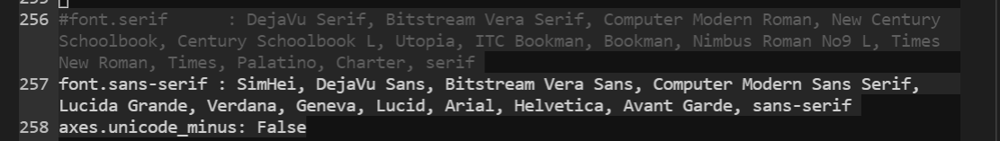

## 基于采样的图神经网络训练与推理流程优化

### 简要介绍

optimize_pygs是基于PyTorch Geometric(PyG 1.5.0)的工作。
针对基于采样的图神经网络训练与推理中存在的两大性能问题：
**1. 采样流程额外开销大、评估步骤耗时较长**
**2. 不同批次间的内存波动大，某些极大值可能导致内存溢出风险。**

针对以上两大性能问题，提出了两种流程优化方法:
**1. 基于流水线并行的图神经网络训练与推理流程优化方法**(neuroc_pygs/sec4_time)
**2. 面向内存受限环境的图神经网络训练与推理流程优化方法**(neuroc_pygs/sec5_memory, neuroc_pygs/sec6_cutting)

### 目录架构

sec4_time, sec5_memory, sec6_cutting目录中文件的详细说明见其`README.md`。

```
neuroc_pygs       // 核心代码
    models              // 模型文件目录
    samplers            // 采样相关目录
        cuda_prefetcher.py     // !!! 采样流程的流水线优化核心代码
        ...
    sec4_time           // 基于流水线并行的图神经网络训练与推理流程优化方法目录
        epoch_opt_full_eval.py
        epoch_opt_full_train.py
        epoch_opt_full_eval.py
        epoch_opt_full_train.py
        opt_experiment.py      // !!! 训练与评估步骤的流水线优化    
        ...
    sec5_memory         // 面向内存受限环境的图神经网络训练与推理流程优化方法目录, 以训练阶段举例
        motivation_predict.py  // !!! 内存超限处理步骤示例文件（训练阶段）
        ...
    sec6_cutting        // 面向内存受限环境的图神经网络训练与推理流程优化方法目录, 以推理阶段举例
        cluster_gcn_predict.py // !!! 内存超限处理步骤示例文件（训练阶段）
        reddit_sage_predict.py // 同上
        ...
    utils               // 工具文件目录
    tools               // PyG安装相关的whl文件目录
    __init__.py     
    base_experiment.py  // 基本运行文件
    opt_experiment.py   // 训练与评估步骤的流水线优化
    eval_full.py        
    eval_sampling.py
    train.py
    configs.py          // 相关配置
    options.py          // 辅助文件
README.md         // 代码说明
requirements.txt  // 依赖库
setup.py          // python库安装文件
```

### 安装说明

这里统一采用pip安装方式：
1. 安装anaconda（[官方文档](https://docs.anaconda.com/anaconda/install/index.html)），创建新的环境`conda create -n optimize-pygs python==3.7.7`，并激活`conda activate optimize-pygs`
2. 安装`PyTorch1.5.0`, [官方文档](https://pytorch.org/), 执行命令`pip install torch==1.5.0+cu101 torchvision==0.6.0+cu101 -f https://download.pytorch.org/whl/torch_stable.html`
3. 安装`PyTorchGeomtric1.5.0`, [官方文档](https://pytorch-geometric.readthedocs.io/en/latest/notes/installation.html), [PyG1.5.0+cu101](https://pytorch-geometric.com/whl/torch-1.5.0+cu101.html)。
    ```
    pip install tools/torch_cluster-1.5.4-cp37-cp37m-linux_x86_64.whl
    pip install tools/torch_scatter-2.0.4-cp37-cp37m-linux_x86_64.whl
    pip install tools/torch_sparse-0.6.4-cp37-cp37m-linux_x86_64.whl
    pip install tools/torch_spline_conv-1.2.0-cp37-cp37m-linux_x86_64.whl
    pip install torch-geometric==1.5.0
    ```
4. 安装其他软件，`pip install -r requirements.txt`
5. 设置目录，将`neuroc_pygs/`文件中设置`dataset_root="xxx/mydata"`, `PROJECT_PATH="xxx/neuroc_pygs"`（即neuroc_pygs目录的绝对位置）。并执行`python setup.py install --user`保存修改。

### 运行环境

- 硬件环境
    - 2 × NVIDIA Tesla T4 GPU( 16GB)
    - CentOS 7 server, 40 cores, 90GB
- 软件环境：
    - Python3.7.7
    - PyTorch1.5.0
    - CUDA10.1
    - PyTorchGeometric1.5.0
    - ogb1.2.3


### 运行说明

假定当前位于`neuroc_pygs`目录下。

1. 常规运行流程，`python base_experiment.py --model gcn --dataset pubmed --mode None --hidden_dims 32 [其他参数]`

2. 基于流水线并行的图神经网络训练推理优化方法
    - 采样流程的流水线优化  `python base_experiment.py --opt_train_flag 1 --opt_eval_flag 1 [其他参数]`
    - 训练与评估步骤的流水线优化 `python opt_experiment.py [其他参数]`
    - 叠加优化 `python opt_experiment.py --opt_train_flag 1 --opt_eval_flag 1 [其他参数]`

3. 面向内存受限环境的图神经网络训练与推理优化方法，训练阶段的例子（`sec5_memory/motivation_predict.py`），推理阶段的例子（`sec5_cutting/cluster_gcn_predict.py`, `sec6_cutting/reddit_sage_predict.py`）。以`sec5_memory/motivation_predict.py`进行介绍，此处采用随机森林作为内存开销预测模型。
    - 进入工作目录，`cd sec5_memory`
    - 构建一定数量的样本，`python build_random_forest_datasets.py`。样本数据保存在`out_random_forest_datasets`目录中。
    - 训练随机森林模型，`python memory_model.py`。训练好的模型文件保存在`out_random_forest_pth`目录中。
    - 使用内存开销预测模型以保证内存稳定的环境，`python motivation_optimize.py`。运行中生成的文件保存在`out_random_forest_res`文件中。

数据集信息

| 数据集 | 点数 | 边数 | 平均度数 | 特征数 | 类别数 | 有向图 |
| --- | --- | --- | --- | --- | --- | --- |
| pubmed | 19,717 | 44,324 | 4.5 | 500 | 3 | 是 |
| amazon-photo | 7,650 | 119,081 | 31.1 | 745 | 8 | 是 |
| amazon-computers | 13,752 | 245,861 | 35.8 | 767 | 10 | 是 |
| coauthor-physics | 34,493 | 247,962 | 14.4 | 8415 | 5 | 是 |
| flickr | 89,250 | 899,756 | 10.1 | 500 | 7 | 否 |
| com-amazon | 334,863 | 925,872 | 2.8 | 32 | 10 | 否 |
| reddit | 232,965 | 23,213,838 | 99.6 | 602 | 41 | 否 |
| yelp | 716,847 | 13,954,819 | 19.5 | 300 | 200 | 是 |
| ogbn-products | 2,449,029 | 13,954,819 | 50.5 | 100 | 47 | 否 | 

随机图这里通过了snap-standford生成。

### 注意事项

1. 当要运行某个py文件时，注意切换到该py文件的目录下再执行
如要执行`neuroc_pygs/sec5_memory/motivation_optimize.py`, 先执行`cd $ROOTPATH/neuroc_pygs/sec5_memory`, 再执行`python motivation_optimize.py`
> `$ROOTPATH`指工程目录，这里即`/home/wangzhaokang/wangyunpan/gnns-project/optimize-pygs`

2. 当修改一个其他文件时，先执行`python setup.py install --user`, 然后再运行该文件。如果没有取得理想的效果，将本地库中的已安装的目录删除后，再执行`python setup.py install --user`，并运行该文件。
> 本地库的路径一般为`/home/xxx/.local/lib/python3.7/site-packages/neuroc_pygs_xxx`

3. 默认数据集的位置是`/mnt/data/wangzhaokang/wangyunpan/data`

4. 如果出现`ImportError: cannot import name '_rebuild' from 'matplotlib.font_manager', 检查并确保matplotlib的版本为3.2.1

5. 如果出现了图片中中文乱码，进行以下[操作](https://blog.csdn.net/txh3093/article/details/106858041?utm_medium=distribute.pc_relevant.none-task-blog-baidujs_title-0&spm=1001.2101.3001.4242)，以conda环境为例:
    - 将SimHei字体复制到fonts文件夹中
    > 找到系统site-packages的maplotlib包的字体的目录，`xxx/anaconda3/envs/optimize-pygs/lib/python3.7/site-packages/matplotlib/mpl-data/fonts/ttf`。将根目录下`tools/SimHei.ttf`复制到以上的字体目录中。
    - 修改matplotlibrc文件的字体设置。
    > `vim xxx/anaconda3/envs/optimize-pygs/lib/python3.7/site-packages/matplotlib/mpl-data/matplotlibrc`。将font.sans-serif前面的#号去掉并在":"后的第一个位置加上SimHei。
    - 保存修改，再执行`python setup.py install --user`