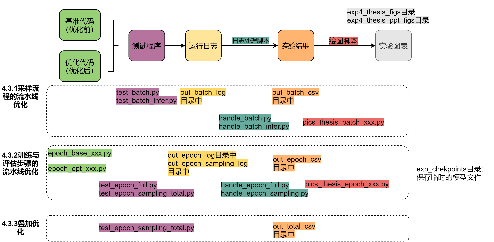

## 基于流水线的图神经网络训练推理流程优化方法

### 简要说明

主要包括了两个优化：
1. 采样流程的优化
2. 训练与评估流程的优化

基于GCN, GGNN, GAT, GaAN四个算法在六个真实数据集上进行了评估。

### 目录结构



```
exp_checkpoints: 训练与评估流程的优化的辅助目录
exp4_thesis_figs: 最终图像文件
exp4_thesis_ppt_figs: 最终图像文件（展示在ppt中）

epoch_utils.py: 一些基本的辅助文件

epoch_base_full.py: 优化前的流程
epoch_base_sampling.py: 同上

epoch_opt_full_eval.py: 训练与评估流程的优化的辅助文件
epoch_opt_full_train.py: 同上
epoch_opt_sampling_eval.py: 同上
epoch_opt_sampling_train.py: 同上

test_xxx: 优化前后的对比的脚本

handle_xxx.py: log日志处理脚本

pics_thesis_xxx.py: 绘图脚本
```
