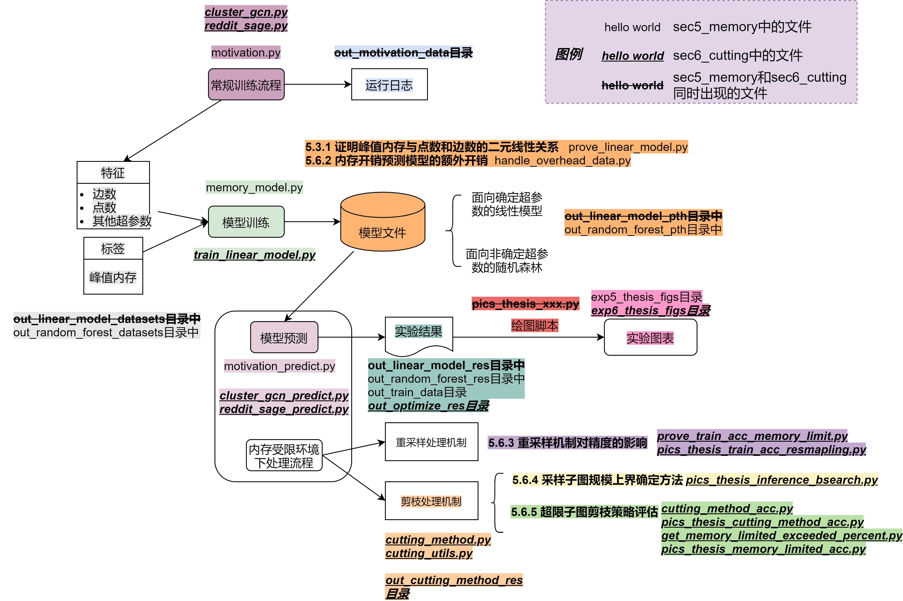

## 面向内存受限环境的图神经网络训练与推理流程优化方法

### 简要介绍

针对图神经网络推理阶段，以SAGE在reddit数据集上, ClusterGCN在ogbn-products数据集上作为代表，评估了基于二分的超限子图剪枝方法和超限子图剪枝策略(对应大论文第5.4和5.5节，第5.6.4节和第5.6.5节)

## 目录结构



```
best_model_pth: 训练好的模型文件
exp6_thesis_figs: 最终的图像文件
out_cutting_method_res: 存储用于评估剪枝策略的训练好的模型文件，剪枝策略对精度的影响文件，剪枝策略的额外开销
out_linear_model_datasets: 推理阶段的内存开销模型的训练样本
out_linear_model_pth: 推理阶段，基于线性的内存开销预测模型的模型文件和一些额外结果
out_linear_model_res: 推理阶段，使用基于线性的内存开销预测模型后得到的模型文件
out_motivation_data: 推理阶段，存储研究动机相关的文件
out_optimize_res: 使用剪枝策略后的结果文件

cluster_gcn.py, reddit_sage.py: 常规处理流程
cluster_gcn_predict.py, reddit_sage_predict.py: 内存受限处理流程

cutting_method.py: 基于度数和PageRank信息的剪枝策略，并汇报其额外开销
cutting_method_acc.py: 图5-16和图5-17, 探究了相对剪枝比例对不同剪枝策略的精度的影响
cutting_utils.py: 基于二分的搜素类
get_memory_limit_exceeded_percent.py: 获取内存受限环境下，超限子图发生的比例

train_linear_model.py: 基于线性模型的内存开销预测的训练文件

pics_thesis_inference_motivation.py: 推理阶段的动机
pics_thesis_cutting_method_acc.py: 剪枝策略的精度
pics_thesis_cutting_overhead.py: 剪枝策略的额外开销
pics_thesis_inference_bsearch.py: 基于二分的采样子图上限方法实际执行结果
pics_thesis_memory_limited_acc.py: 内存受限下，使用剪枝策略后的精度结果
```

### 注意事项

如果出现以下目录找不到，请手动建立:
```
best_model_pth
exp6_thesis_figs
out_cutting_method_res
out_linear_model_datasets
out_linear_model_pth
out_linear_model_res
out_motivation_data
out_optimize_res
```